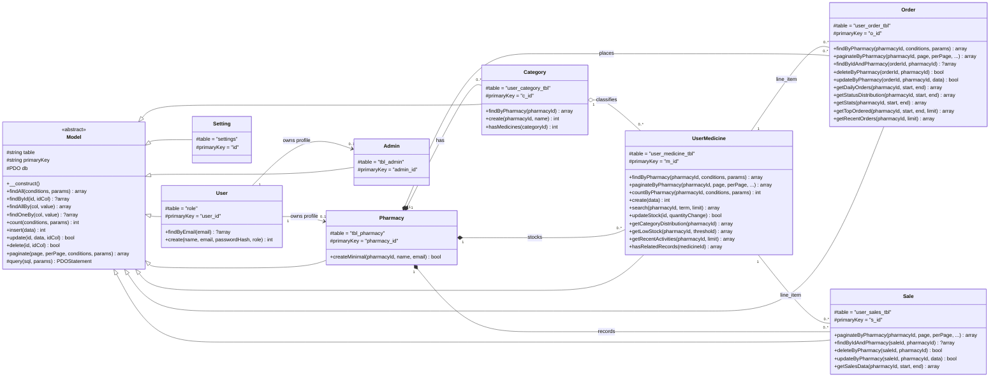
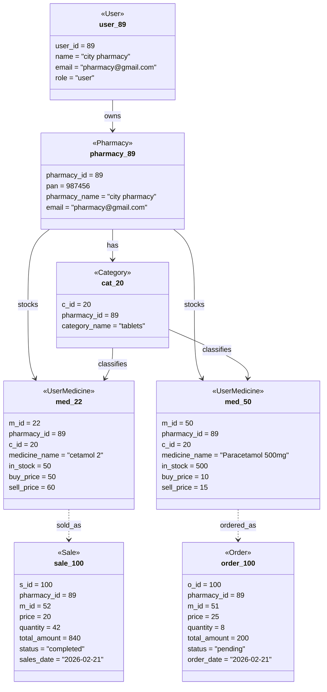
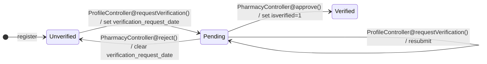
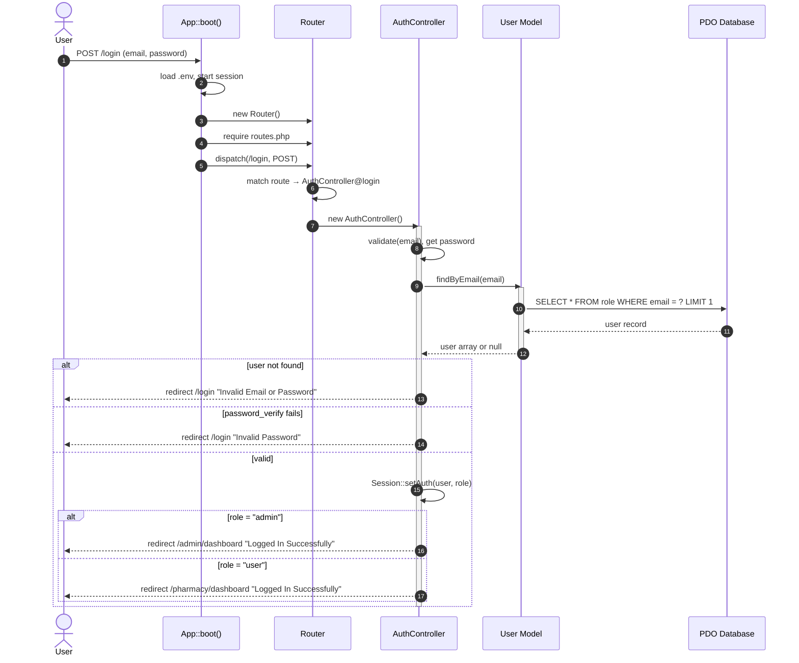
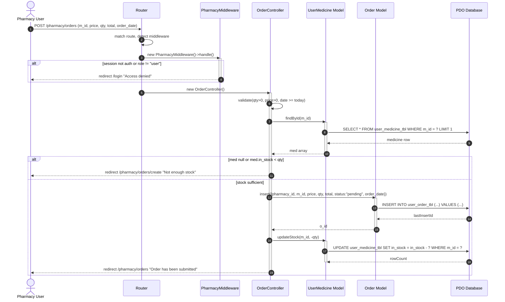
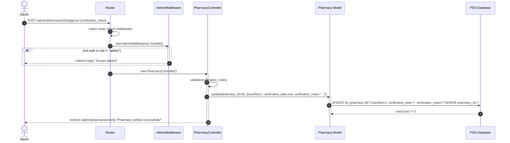
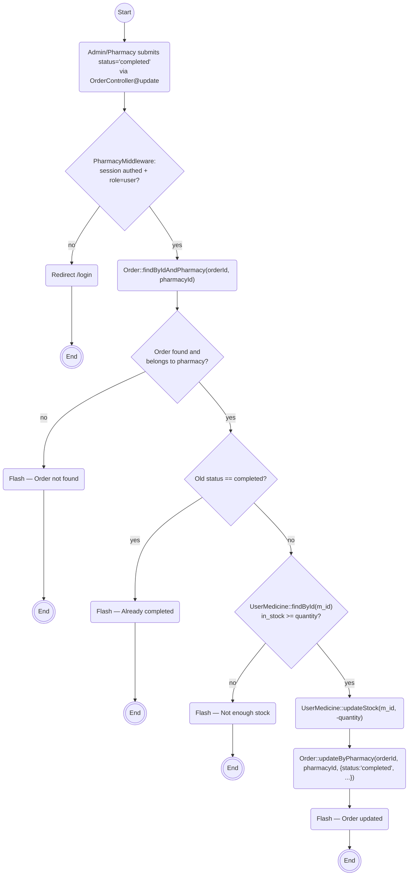
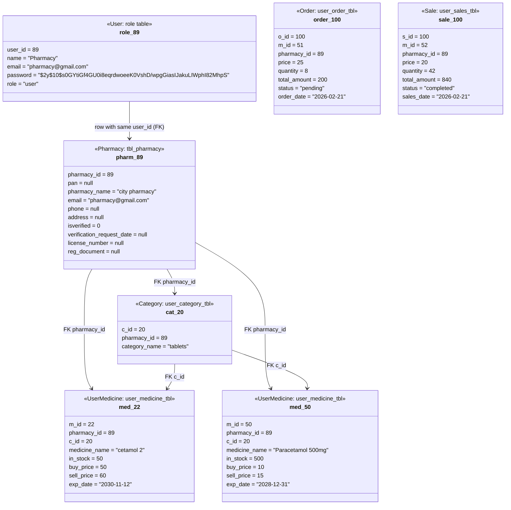
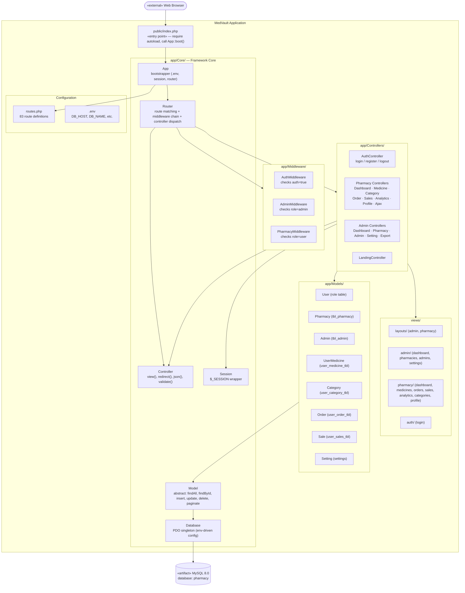
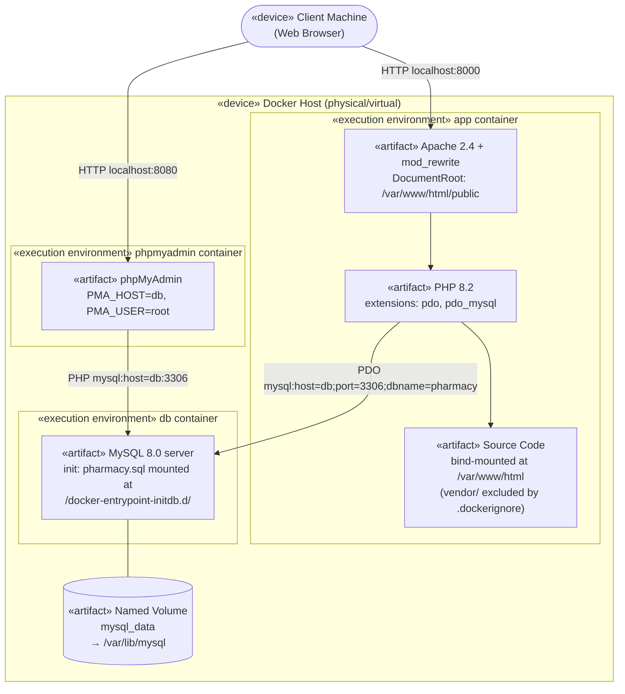

# MedVault — UML Diagrams

All diagrams are verified against the actual codebase at commit time. Every class name, method signature, route, database column, and control flow reflects the source code, not an assumed design.

---

## 1. Class Diagram

Eight concrete models extend the abstract `App\Core\Model`. All persistence uses PDO prepared statements through the base class.



### Database Table Details

| Model | Table | PK | FK Column | References |
|-------|-------|----|-----------|------------|
| `User` | `role` | `user_id` | — | — |
| `Pharmacy` | `tbl_pharmacy` | `pharmacy_id` | `pharmacy_id` | `role.user_id` |
| `Admin` | `tbl_admin` | `admin_id` | `admin_id` | `role.user_id` |
| `Category` | `user_category_tbl` | `c_id` | `pharmacy_id` | `role.user_id` |
| `UserMedicine` | `user_medicine_tbl` | `m_id` | `pharmacy_id`, `c_id` | `role.user_id`, `user_category_tbl.c_id` |
| `Order` | `user_order_tbl` | `o_id` | `m_id`, `pharmacy_id` | `user_medicine_tbl.m_id`, `role.user_id` |
| `Sale` | `user_sales_tbl` | `s_id` | `m_id`, `pharmacy_id` | `user_medicine_tbl.m_id`, `role.user_id` |
| `Setting` | `settings` | `id` | — | — |

---

## 2. Object Diagram

Snapshot of pharmacy `user_id = 89` (from sample data). Shows category `tablets`, two medicines, one pending order, one completed sale.



---

## 3. State Transition Diagrams

### Order Lifecycle

Based on `OrderController@store` (inserts pending) and `OrderController@update` (status transitions with stock side-effects).

```mermaid
stateDiagram-v2
    direction LR

    [*] --> pending : OrderController@store()

    pending --> completed : update() [in_stock >= qty] / UserMedicine::updateStock(-qty)
    completed --> pending : update() [restore stock] / UserMedicine::updateStock(+qty)

    pending --> [*] : destroy() / no stock restore
    completed --> [*] : destroy() / UserMedicine::updateStock(+qty)
```

### Sale Lifecycle

**Important:** `SalesController@store()` inserts a sale as `pending` but does **not** deduct stock. Stock is deducted **only** when `SalesController@update()` transitions from `pending` to `completed`.

```mermaid
stateDiagram-v2
    direction LR

    [*] --> pending : SalesController@store() / no stock change

    pending --> completed : update() / UserMedicine::updateStock(-qty)
    completed --> pending : update() / UserMedicine::updateStock(+qty)

    pending --> [*] : destroy() / no stock restore
    completed --> [*] : destroy() / UserMedicine::updateStock(+qty)
```

### Authentication Session

Based on `AuthController@login`, `AuthController@logout`, and `AuthMiddleware`/`PharmacyMiddleware`/`AdminMiddleware`.

```mermaid
stateDiagram-v2
    direction TB

    [*] --> Guest

    Guest --> Guest : login [password_verify fails] / flash error
    Guest --> Authenticated : login [password_verify ok]

    state Authenticated {
        direction LR
        [*] --> AdminRole : loggedInUserRole = "admin"
        [*] --> PharmacyRole : loggedInUserRole = "user"
    }

    Authenticated --> Guest : logout / Session::destroy()
```

### Pharmacy Verification Lifecycle

Based on `ProfileController@requestVerification`, `PharmacyController@approve`, `PharmacyController@reject`.



---

## 4. Sequence Diagrams

### Login Flow

Actual route: `POST /login` → `AuthController@login`



### Pharmacy Places Order

Actual route: `POST /pharmacy/orders` → `OrderController@store` (with `PharmacyMiddleware`)



### Admin Approves Pharmacy Verification

Actual route: `POST /admin/pharmacies/{id}/approve` → `PharmacyController@approve` (with `AdminMiddleware`)



---

## 5. Activity Diagram — Order Completion via Status Update

This workflow follows `OrderController@update` which handles completing a pending order. Auth is checked by `PharmacyMiddleware` before the controller runs.



---

## 6. Refinement of Class — Full Database Schema Mapping

Each model mapped to its actual database table with column types. `User` (table `role`) is the parent entity; `Pharmacy` and `Admin` are child profiles sharing the same PK as `role.user_id`.

```mermaid
classDiagram
    direction TB

    class role_table {
        +int user_id PK AUTO_INCREMENT
        +varchar(100) name
        +varchar(50) email
        +varchar(255) password (bcrypt hash)
        +varchar(10) role ("admin"|"user")
    }

    class tbl_pharmacy {
        +int pharmacy_id PK FK → role.user_id
        +int pan
        +varchar(100) pharmacy_name
        +varchar(50) email
        +varchar(10) phone
        +varchar(50) address
        +tinyint isverified (0|1)
        +datetime verification_request_date
        +datetime verification_date
        +varchar(100) license_number
        +varchar(255) reg_document (path)
        +text verification_notes
        +datetime created_at
    }

    class tbl_admin {
        +int admin_id PK FK → role.user_id
        +varchar(100) name
        +varchar(50) email
        +varchar(10) gender
        +varchar(10) phone
        +date dob
        +varchar(50) address
    }

    class user_medicine_tbl {
        +int m_id PK AUTO_INCREMENT
        +int pharmacy_id FK
        +varchar(100) medicine_name
        +varchar(1000) medicine_desc
        +int c_id FK → user_category_tbl
        +int in_stock
        +int buy_price
        +int sell_price
        +timestamp added_date
        +date exp_date
    }

    class user_category_tbl {
        +int c_id PK AUTO_INCREMENT
        +int pharmacy_id FK
        +varchar(30) category_name
    }

    class user_order_tbl {
        +int o_id PK AUTO_INCREMENT
        +int m_id FK → user_medicine_tbl
        +int pharmacy_id FK
        +int price
        +int quantity
        +int total_amount
        +varchar(20) status
        +date order_date
    }

    class user_sales_tbl {
        +int s_id PK AUTO_INCREMENT
        +int m_id FK → user_medicine_tbl
        +int pharmacy_id FK
        +int price
        +int quantity
        +int total_amount
        +varchar(20) status
        +date sales_date
    }

    class settings {
        +int id PK AUTO_INCREMENT
        +varchar(255) title
        +text small_description
        +varchar(255) sub_title
        +text sub_description
        +varchar(10) phone
        +varchar(50) email
    }

    role_table --> tbl_pharmacy : pharmacy_id = user_id (1:1)
    role_table --> tbl_admin : admin_id = user_id (1:1)
    tbl_pharmacy --> user_medicine_tbl : pharmacy_id
    tbl_pharmacy --> user_category_tbl : pharmacy_id
    tbl_pharmacy --> user_order_tbl : pharmacy_id
    tbl_pharmacy --> user_sales_tbl : pharmacy_id
    user_category_tbl --> user_medicine_tbl : c_id
    user_medicine_tbl --> user_order_tbl : m_id
    user_medicine_tbl --> user_sales_tbl : m_id
```

---

## 7. Refinement of Object — Full Row Values

Actual data from `pharmacy.sql` dump and usage patterns in the code. Pharmacy `user_id = 89` ("city pharmacy") with one category, two medicines, one order, one sale.



---

## 8. Component Diagram

Maps to actual code directories under `app/`, `views/`, `routes.php`, `public/index.php`, and `vendor/`.



---

## 9. Deployment Diagram

Docker Compose topology with three containers on a single host, as defined in `docker-compose.yml` and `Dockerfile`.



### Environment Variables

| File | Variable | Value |
|------|----------|-------|
| docker-compose.yml | `DB_HOST` | `db` (Docker DNS name) |
| docker-compose.yml | `DB_NAME` | `pharmacy` |
| docker-compose.yml | `DB_USER` | `root` |
| docker-compose.yml | `DB_PASS` | `medvault` |
| docker-compose.yml | `APP_URL` | `http://localhost:8000` |
| Dockerfile | — | Exposes port 80 (mapped to host 8000) |

---

## Correction Log

| # | Issue in previous version | Correction |
|---|---------------------------|------------|
| 1 | `Model::findById` return type `array` | Changed to `?array` (can return null) |
| 2 | Object diagram used fictional "HealthFirst" data | Replaced with actual data from `pharmacy.sql` (user_id=89) |
| 3 | Sale state diagram showed "deduct stock" on `store()` | **Fixed**: `SalesController@store()` does NOT deduct stock. Stock deducted only in `update()`. |
| 4 | Sequence: Login showed `Router` as direct handler | Now shows `App::boot()` → `Router::dispatch()` → `AuthController` |
| 5 | Sequence: Order missing middleware layer | Added `PharmacyMiddleware` as explicit guard before controller |
| 6 | Activity diagram assumed old codebase flow | Rewired to match `OrderController@update` with middleware pre-check |
| 7 | Refined Class used `TblPharmacy` / `Role` / `Settings` class names | Corrected to `Pharmacy` / `User` / `Setting` (actual model class names) |
| 8 | Refined Class used invalid Mermaid arrow syntax | Replaced with valid `-->` FK reference notation |
| 9 | Refined Object used `<<TblPharmacy>>` / `<<Role>>` stereotypes | Changed to `<<Pharmacy>>` / `<<User>>` with table name in parentheses |
| 10 | Component diagram had abstract "Presentation Layer" | Replaced with actual file directory structure (`views/`, `public/index.php`) |
| 11 | Deployment: text mentioned port 8001 (not in compose file) | Removed spurious 8001 reference. Port mapping is `8000:80` per `docker-compose.yml` |
