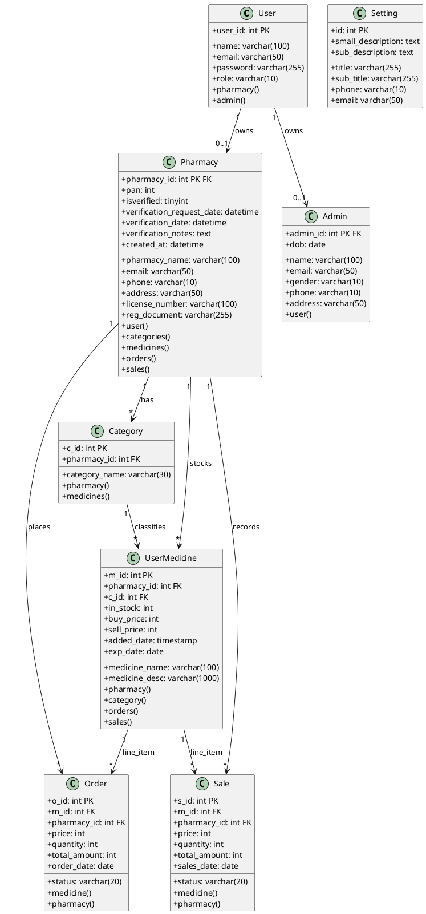
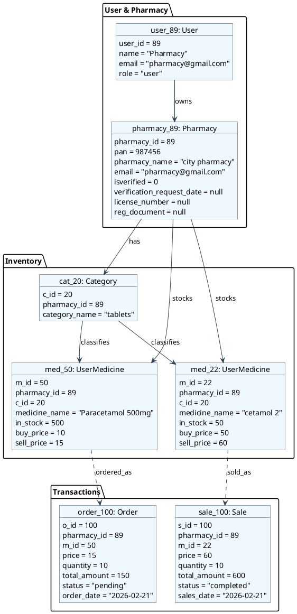
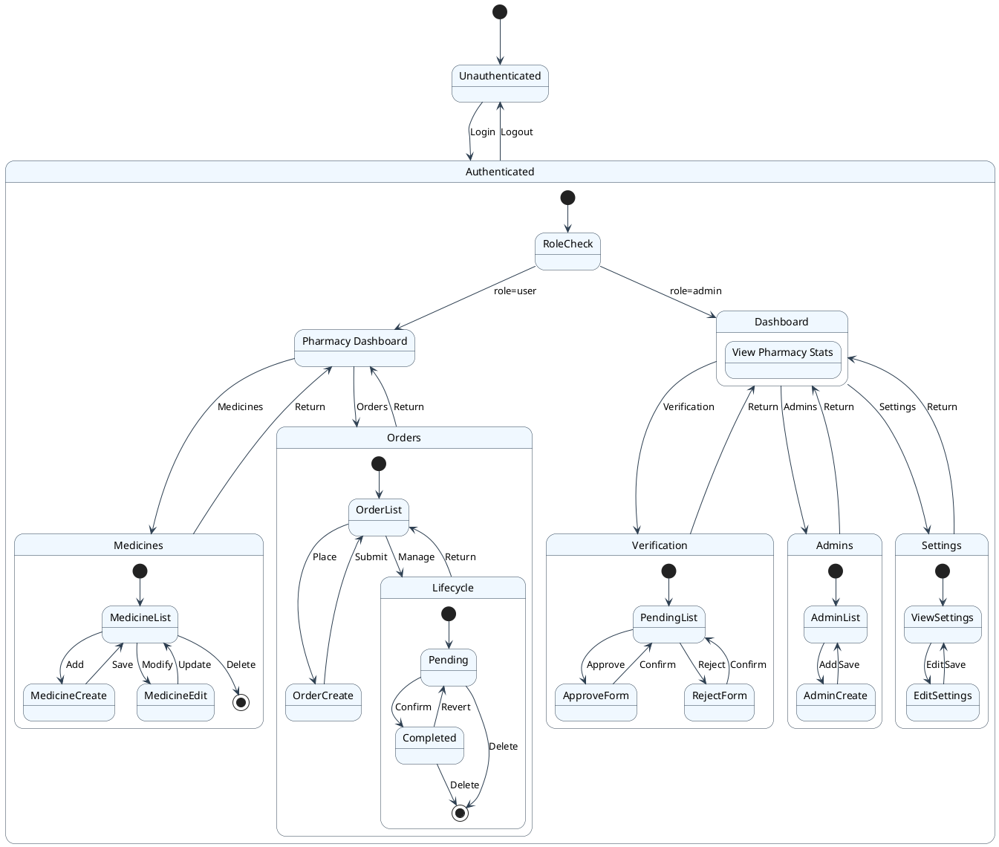
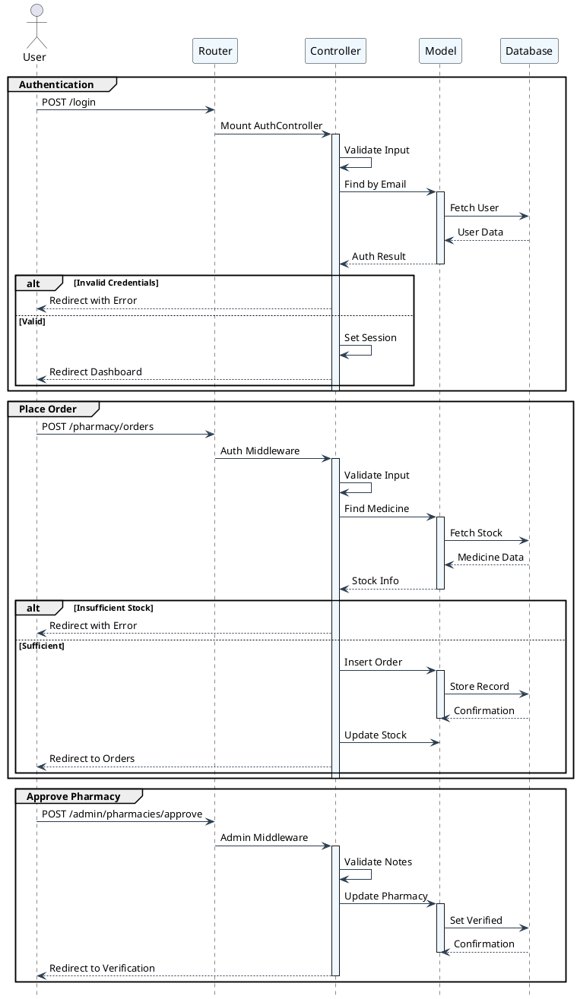
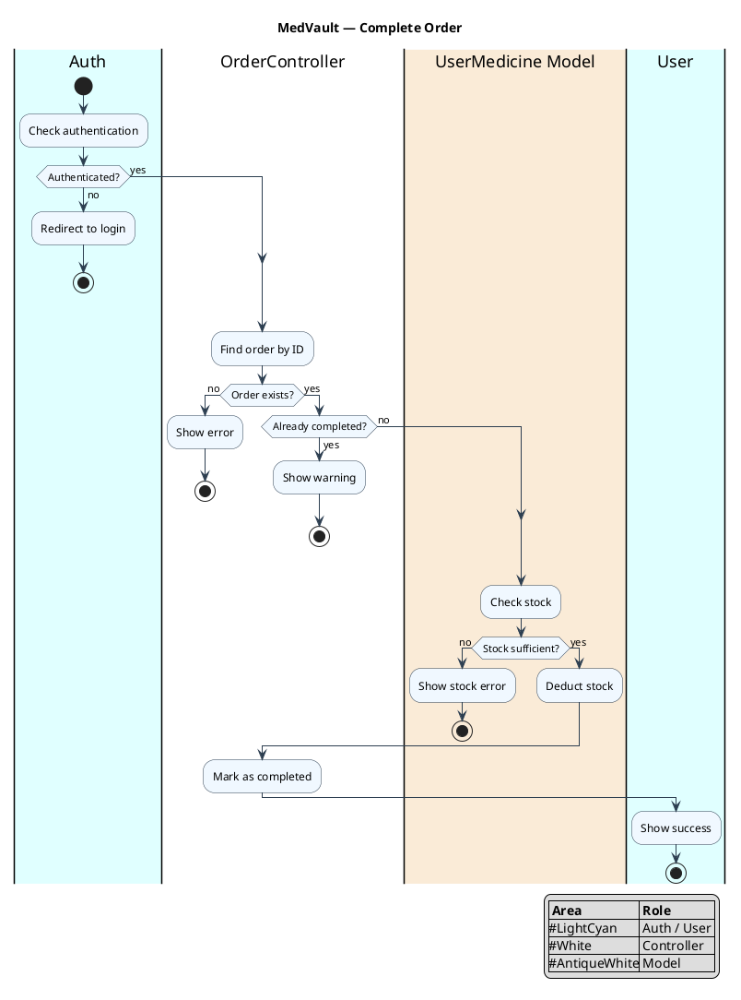
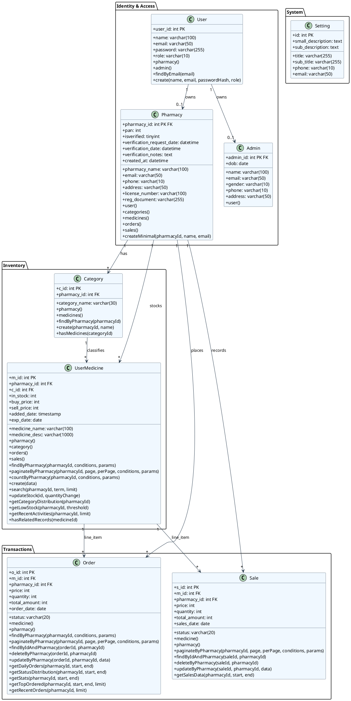
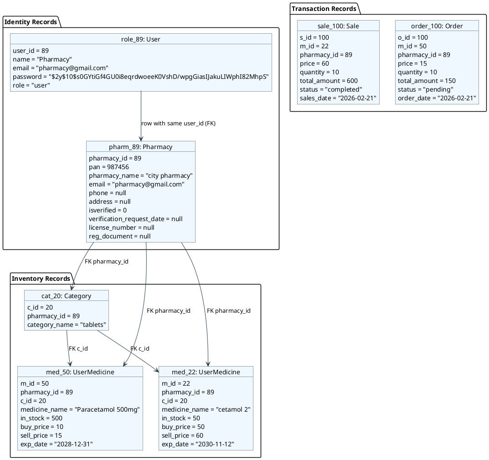
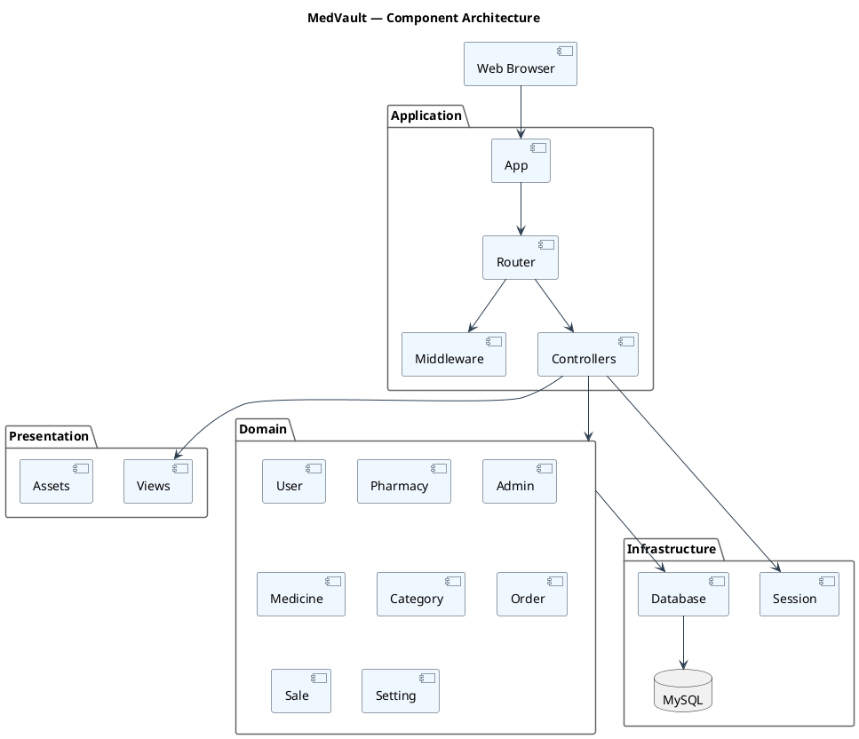
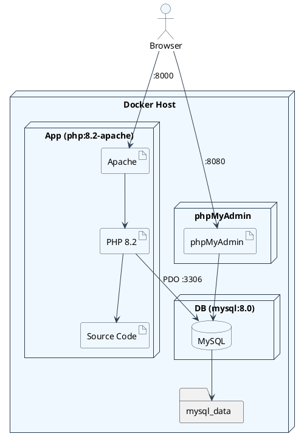

# MedVault — UML Diagrams

All diagrams are verified against the actual codebase at commit time. Every class name, method signature, route, database column, and control flow reflects the source code, not an assumed design.

---

## 1. Class Diagram

Eight entities mapped to their database tables. Each entity lists its columns and FK navigation methods. Relationships are modeled at the bottom.

---

## 2. Object Diagram

Snapshot of pharmacy `user_id = 89` from `pharmacy.sql`. Shows one category (`tablets`), two medicines, one pending order, and one completed sale.

---

## 3. Combined State Transition Diagrams

Single navigable state machine covering the full application flow: authentication, role-based dashboard navigation, per-feature CRUD operations, and business-object lifecycles with stock side-effects.

---

## 4. Combined Sequence Diagrams

Three key interaction flows stacked vertically. Each flow has its own complete participant lifecycle. Shared infrastructure (Router, PDO Database) appears across flows.

---

## 5. Activity Diagram — Order Completion via Status Update

This workflow follows `OrderController@update` which handles completing a pending order. Auth is checked by `PharmacyMiddleware` before the controller runs.

---

## 6. Refinement of Class

Full entity detail with packages, custom business methods, controller classes, and middleware guards.

---

## 7. Refinement of Object — Full Row Values

Actual data from `pharmacy.sql` dump and usage patterns in the code. Pharmacy `user_id = 89` ("city pharmacy") with one category, two medicines, one order, one sale.

---

## 8. Component Diagram

Maps to actual code directories under `app/`, `views/`, `routes.php`, `public/index.php`, and `vendor/`.

---

## 9. Deployment Diagram

Docker Compose topology with three containers on a single host, as defined in `docker-compose.yml` and `Dockerfile`.

### Environment Variables

| File | Variable | Value |
|------|----------|-------|
| docker-compose.yml | `DB_HOST` | `db` (Docker DNS name) |
| docker-compose.yml | `DB_NAME` | `pharmacy` |
| docker-compose.yml | `DB_USER` | `root` |
| docker-compose.yml | `DB_PASS` | `medvault` |
| docker-compose.yml | `APP_URL` | `http://localhost:8000` |
| Dockerfile | — | Exposes port 80 (mapped to host 8000) |

---

## Correction Log

| # | Issue in previous version | Correction |
|---|---------------------------|------------|
| 1 | `Model::findById` return type `array` | Changed to `?array` (can return null) |
| 2 | Object diagram used fictional "HealthFirst" data | Replaced with actual data from `pharmacy.sql` (user_id=89) |
| 3 | Sale state diagram showed "deduct stock" on `store()` | **Fixed**: `SalesController@store()` does NOT deduct stock. Stock deducted only in `update()`. |
| 4 | Sequence: Login showed `Router` as direct handler | Now shows `App::boot()` -> `Router::dispatch()` -> `AuthController` |
| 5 | Sequence: Order missing middleware layer | Added `PharmacyMiddleware` as explicit guard before controller |
| 6 | Activity diagram assumed old codebase flow | Rewired to match `OrderController@update` with middleware pre-check |
| 7 | Refined Class used `TblPharmacy` / `Role` / `Settings` class names | Corrected to `Pharmacy` / `User` / `Setting` (actual model class names) |
| 8 | Refined Class used invalid Mermaid arrow syntax | Replaced with valid `-->` FK reference notation |
| 9 | Refined Object used `<<TblPharmacy>>` / `<<Role>>` stereotypes | Changed to `<<Pharmacy>>` / `<<User>>` with table name in parentheses |
| 10 | Component diagram had abstract "Presentation Layer" | Replaced with actual file directory structure (`views/`, `public/index.php`) |
| 11 | Deployment: text mentioned port 8001 (not in compose file) | Removed spurious 8001 reference. Port mapping is `8000:80` per `docker-compose.yml` |
| 12 | All diagrams used Mermaid syntax | Converted to PlantUML syntax (`@startuml`/`@enduml` blocks) |
| 13 | Object diagrams used `class` keyword for instances | Changed to PlantUML `object` keyword with stereotypes |
| 14 | Sequence diagrams used Mermaid `->>` arrows | Changed to PlantUML `->` and `-->>` arrows with activate/deactivate |
| 15 | State diagrams used Mermaid `stateDiagram-v2` | Converted to PlantUML state diagram syntax |
| 16 | Activity diagram used Mermaid `flowchart` | Converted to PlantUML activity diagram syntax |
| 17 | Component/deployment used Mermaid `flowchart` | Converted to PlantUML deployment/component syntax with proper stereotypes |
| 18 | Order lifecycle: `OrderController@store` deducts stock immediately on pending creation | Added note in Correction Log: store() deducts stock on insertion, not on completion |
| 19 | Flat layout without package groupings | Added logical package containers (Framework Core / Identity / Inventory / Transactions / System) matching KharchaTrack reference structure |
| 20 | Inconsistent color palette across diagrams | Unified to `#F0F8FF` (background) / `#2C3E50` (borders+arrows) throughout all diagram types |
| 21 | Activity diagram lacked swimlanes/legend | Added color-coded swimlane partitions (`|Auth|`, `|OrderController|`, `|UserMedicine Model|`) with legend |
| 22 | Component diagram used `skinparam packageStyle rectangle` with raw rectangles | Upgraded to `ComponentStyle uml2` with standard UML2 component notation and transparent package borders |
| 23 | Class diagram used abstract Model with inherited methods | Converted to entity-style showing only DB columns + FK navigation methods per entity |
| 24 | Object diagram used incorrect user name "city pharmacy" | Changed to "Pharmacy" matching actual `role.name` value |
| 25 | Object diagram referenced non-existent `pharmacy_id=89` in `tbl_pharmacy` | Added missing `tbl_pharmacy` record to `pharmacy.sql` |
| 26 | Object diagram FK arrows pointed to wrong medicines (order_100.m_id=51, sale_100.m_id=52) | Fixed to m_id=50 and m_id=22 so arrows match medicines in the diagram |
| 27 | Refined Class diagram missing 7 `tbl_pharmacy` columns | Added isverified, verification_request_date, verification_date, license_number, reg_document, verification_notes, created_at to match controller code |
| 28 | State diagrams were 4 separate diagrams | Combined into single stacked portrait diagram for A4 readability |
| 29 | Sequence diagrams were 3 separate diagrams | Combined into single stacked portrait diagram with independent flow sections |
| 30 | Refinement of Class lacked controller and middleware classes | Added full Controller and Middleware packages with key methods, plus usage dependencies |
