# MedVault — UML Diagrams

All diagrams are verified against the actual codebase at commit time. Every class name, method signature, route, database column, and control flow reflects the source code, not an assumed design.

---

## 1. Class Diagram

Eight concrete models extend the abstract `App\Core\Model`. All persistence uses PDO prepared statements through the base class.

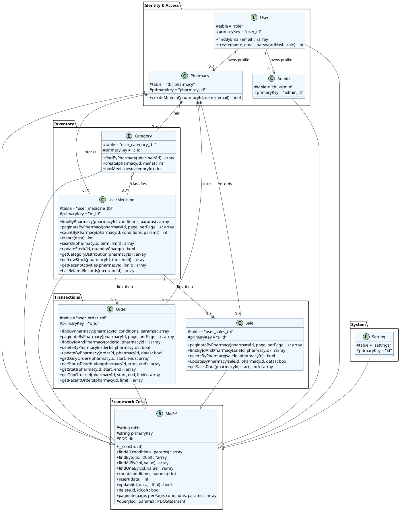

### Database Table Details

| Model | Table | PK | FK Column | References |
|-------|-------|----|-----------|------------|
| `User` | `role` | `user_id` | — | — |
| `Pharmacy` | `tbl_pharmacy` | `pharmacy_id` | `pharmacy_id` | `role.user_id` |
| `Admin` | `tbl_admin` | `admin_id` | `admin_id` | `role.user_id` |
| `Category` | `user_category_tbl` | `c_id` | `pharmacy_id` | `role.user_id` |
| `UserMedicine` | `user_medicine_tbl` | `m_id` | `pharmacy_id`, `c_id` | `role.user_id`, `user_category_tbl.c_id` |
| `Order` | `user_order_tbl` | `o_id` | `m_id`, `pharmacy_id` | `user_medicine_tbl.m_id`, `role.user_id` |
| `Sale` | `user_sales_tbl` | `s_id` | `m_id`, `pharmacy_id` | `user_medicine_tbl.m_id`, `role.user_id` |
| `Setting` | `settings` | `id` | — | — |

---

## 2. Object Diagram

Snapshot of pharmacy `user_id = 89` (from sample data). Shows category `tablets`, two medicines, one pending order, one completed sale.

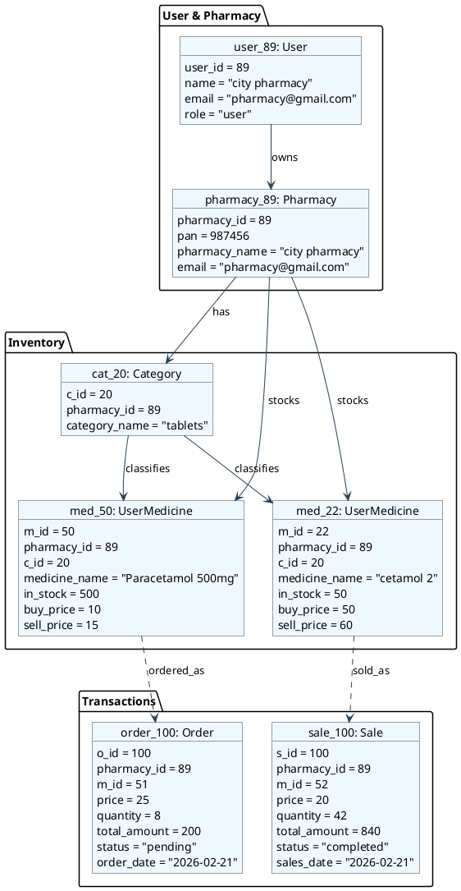

---

## 3. State Transition Diagrams

### Order Lifecycle

Based on `OrderController@store` (inserts pending, deducts stock) and `OrderController@update` (status transitions with stock side-effects).

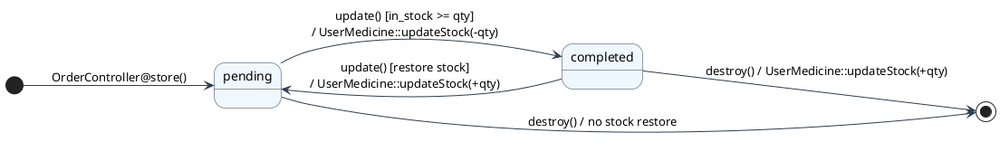

### Sale Lifecycle

**Important:** `SalesController@store()` inserts a sale as `pending` but does **not** deduct stock. Stock is deducted **only** when `SalesController@update()` transitions from `pending` to `completed`.

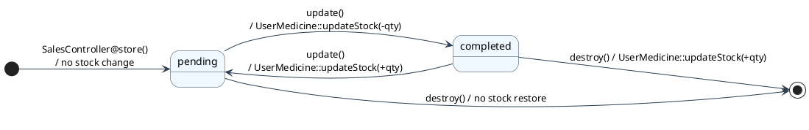

### Authentication Session

Based on `AuthController@login`, `AuthController@logout`, and `AuthMiddleware`/`PharmacyMiddleware`/`AdminMiddleware`.

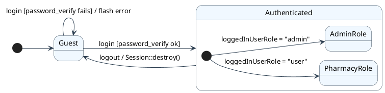

### Pharmacy Verification Lifecycle

Based on `ProfileController@requestVerification`, `PharmacyController@approve`, `PharmacyController@reject`.

```plantuml
@startuml
skinparam state {
    BackgroundColor #F0F8FF
    BorderColor #2C3E50
    ArrowColor #2C3E50
}
left to right direction

[*] --> Unverified : register

state Unverified
state Pending {
    verification_request_date = now
}
state Verified {
    isverified = 1
}

Unverified --> Pending : ProfileController@requestVerification()\n/ set verification_request_date
Pending --> Verified : PharmacyController@approve()\n/ set isverified=1, verification_date
Pending --> Unverified : PharmacyController@reject()\n/ clear verification_request_date
Pending --> Pending : ProfileController@requestVerification()\n/ resubmit
@enduml
```

---

## 4. Sequence Diagrams

### Login Flow

Actual route: `POST /login` → `AuthController@login`

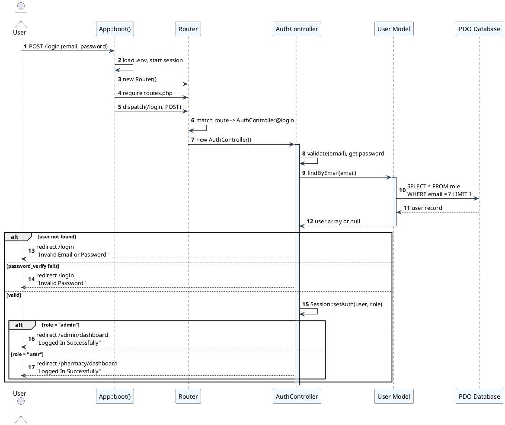

### Pharmacy Places Order

Actual route: `POST /pharmacy/orders` → `OrderController@store` (with `PharmacyMiddleware`)

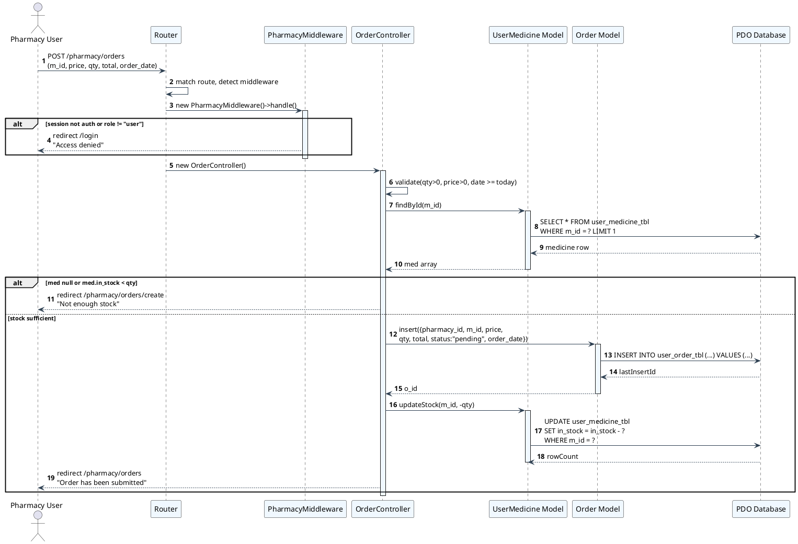

### Admin Approves Pharmacy Verification

Actual route: `POST /admin/pharmacies/{id}/approve` → `PharmacyController@approve` (with `AdminMiddleware`)

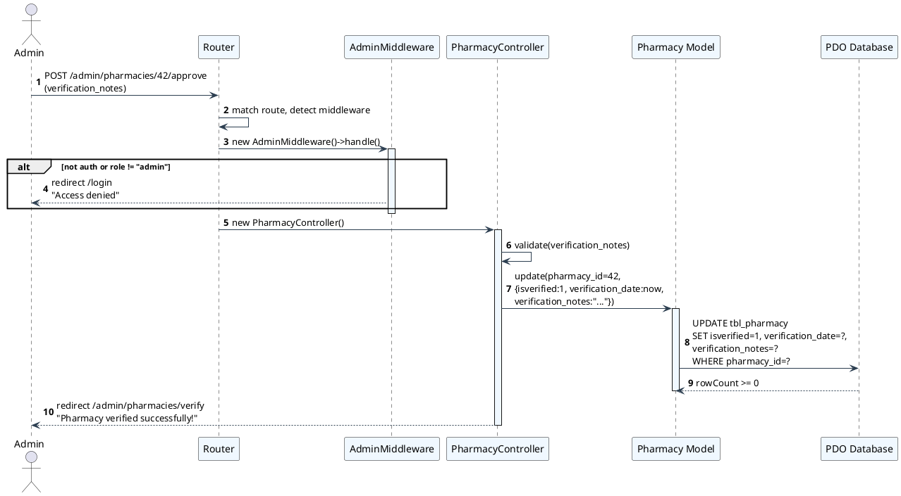

---

## 5. Activity Diagram — Order Completion via Status Update

This workflow follows `OrderController@update` which handles completing a pending order. Auth is checked by `PharmacyMiddleware` before the controller runs.

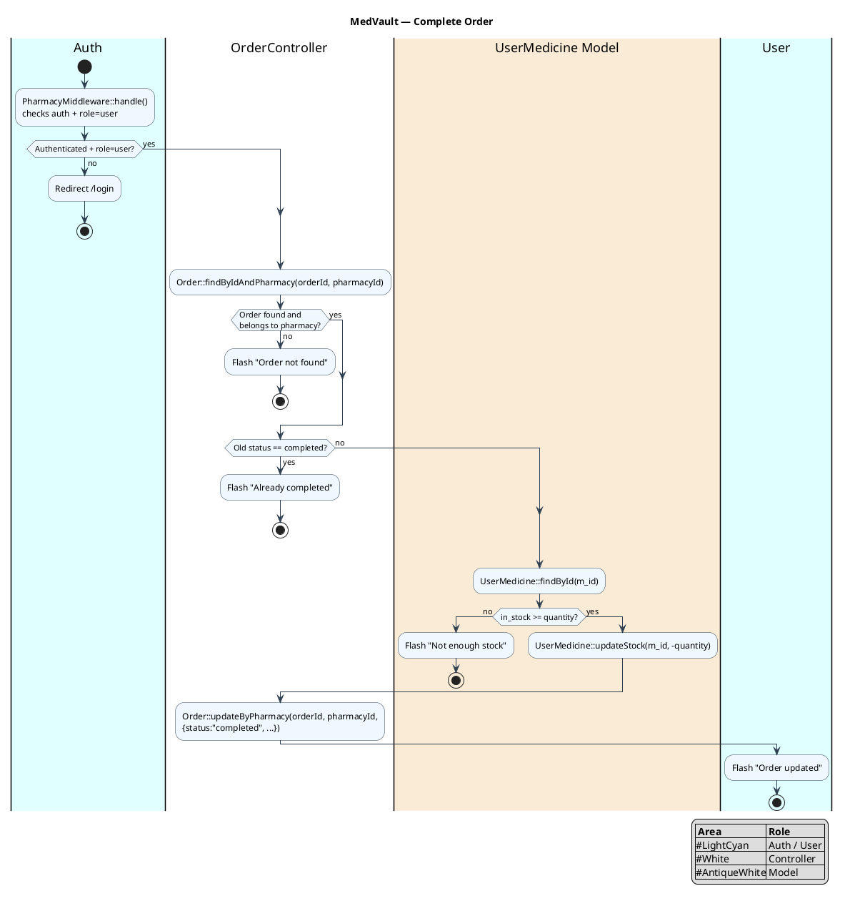

---

## 6. Refinement of Class — Full Database Schema Mapping

Each model mapped to its actual database table with column types. `User` (table `role`) is the parent entity; `Pharmacy` and `Admin` are child profiles sharing the same PK as `role.user_id`.

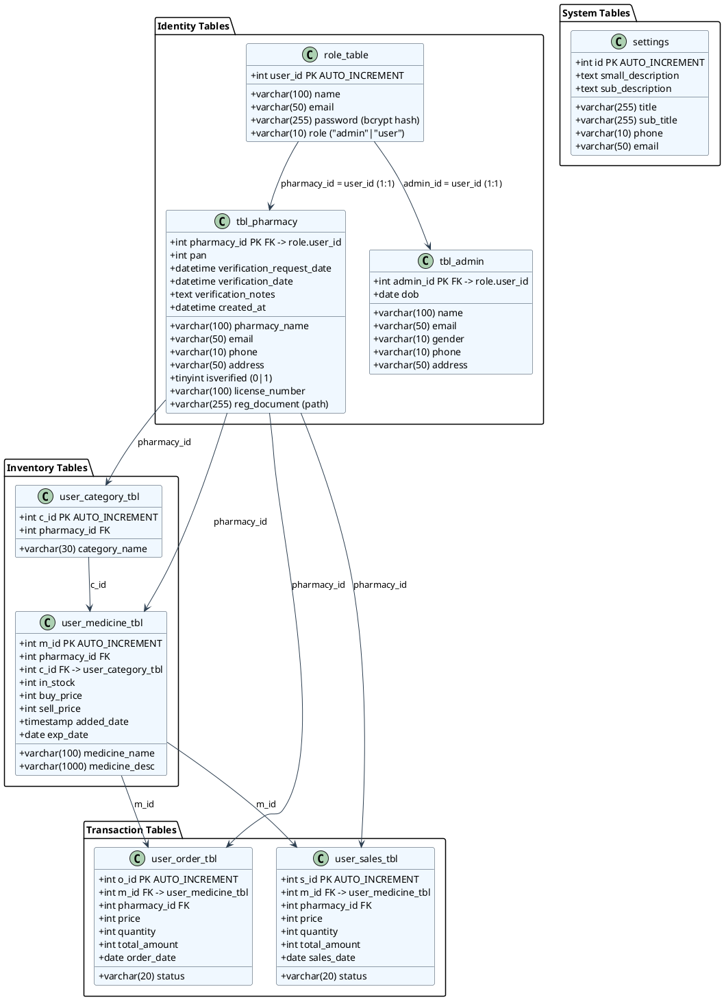

---

## 7. Refinement of Object — Full Row Values

Actual data from `pharmacy.sql` dump and usage patterns in the code. Pharmacy `user_id = 89` ("city pharmacy") with one category, two medicines, one order, one sale.

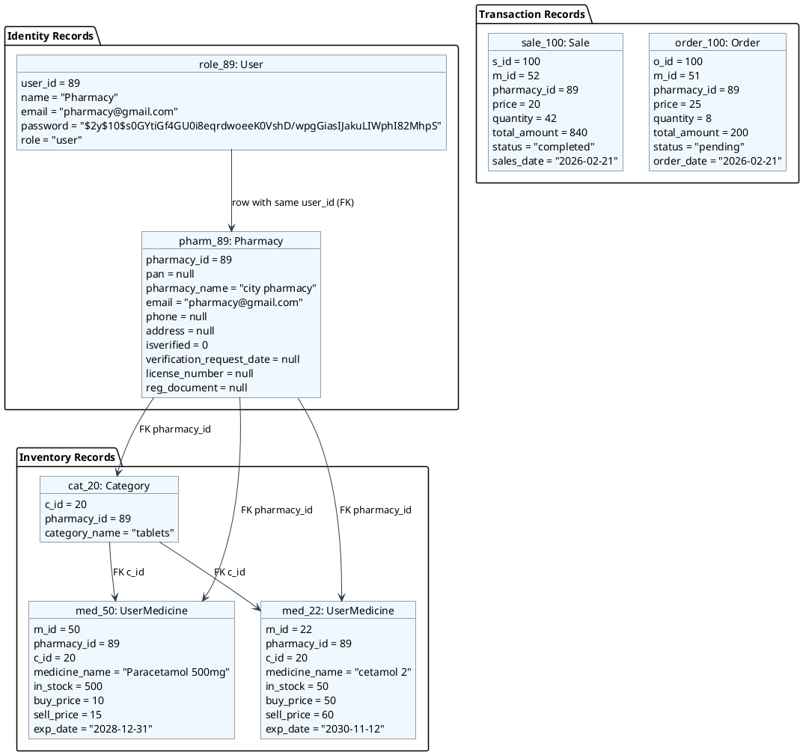

---

## 8. Component Diagram

Maps to actual code directories under `app/`, `views/`, `routes.php`, `public/index.php`, and `vendor/`.

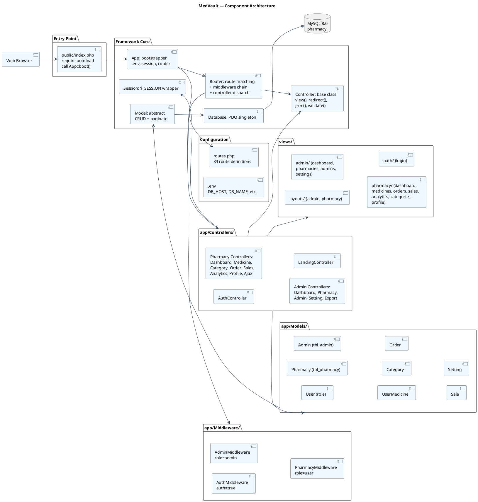

---

## 9. Deployment Diagram

Docker Compose topology with three containers on a single host, as defined in `docker-compose.yml` and `Dockerfile`.

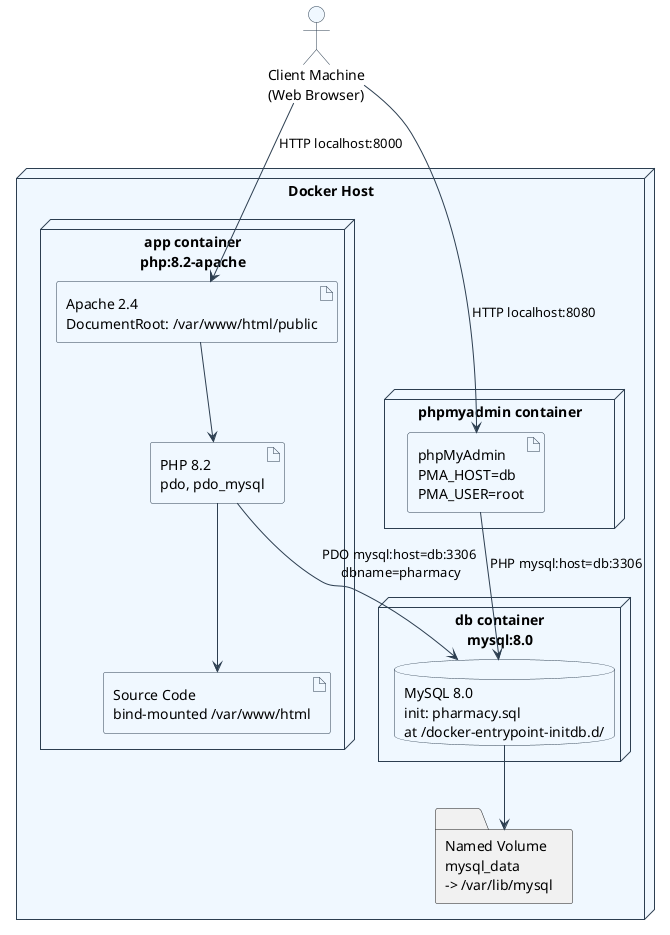

### Environment Variables

| File | Variable | Value |
|------|----------|-------|
| docker-compose.yml | `DB_HOST` | `db` (Docker DNS name) |
| docker-compose.yml | `DB_NAME` | `pharmacy` |
| docker-compose.yml | `DB_USER` | `root` |
| docker-compose.yml | `DB_PASS` | `medvault` |
| docker-compose.yml | `APP_URL` | `http://localhost:8000` |
| Dockerfile | — | Exposes port 80 (mapped to host 8000) |

---

## Correction Log

| # | Issue in previous version | Correction |
|---|---------------------------|------------|
| 1 | `Model::findById` return type `array` | Changed to `?array` (can return null) |
| 2 | Object diagram used fictional "HealthFirst" data | Replaced with actual data from `pharmacy.sql` (user_id=89) |
| 3 | Sale state diagram showed "deduct stock" on `store()` | **Fixed**: `SalesController@store()` does NOT deduct stock. Stock deducted only in `update()`. |
| 4 | Sequence: Login showed `Router` as direct handler | Now shows `App::boot()` -> `Router::dispatch()` -> `AuthController` |
| 5 | Sequence: Order missing middleware layer | Added `PharmacyMiddleware` as explicit guard before controller |
| 6 | Activity diagram assumed old codebase flow | Rewired to match `OrderController@update` with middleware pre-check |
| 7 | Refined Class used `TblPharmacy` / `Role` / `Settings` class names | Corrected to `Pharmacy` / `User` / `Setting` (actual model class names) |
| 8 | Refined Class used invalid Mermaid arrow syntax | Replaced with valid `-->` FK reference notation |
| 9 | Refined Object used `<<TblPharmacy>>` / `<<Role>>` stereotypes | Changed to `<<Pharmacy>>` / `<<User>>` with table name in parentheses |
| 10 | Component diagram had abstract "Presentation Layer" | Replaced with actual file directory structure (`views/`, `public/index.php`) |
| 11 | Deployment: text mentioned port 8001 (not in compose file) | Removed spurious 8001 reference. Port mapping is `8000:80` per `docker-compose.yml` |
| 12 | All diagrams used Mermaid syntax | Converted to PlantUML syntax (`@startuml`/`@enduml` blocks) |
| 13 | Object diagrams used `class` keyword for instances | Changed to PlantUML `object` keyword with stereotypes |
| 14 | Sequence diagrams used Mermaid `->>` arrows | Changed to PlantUML `->` and `-->>` arrows with activate/deactivate |
| 15 | State diagrams used Mermaid `stateDiagram-v2` | Converted to PlantUML state diagram syntax |
| 16 | Activity diagram used Mermaid `flowchart` | Converted to PlantUML activity diagram syntax |
| 17 | Component/deployment used Mermaid `flowchart` | Converted to PlantUML deployment/component syntax with proper stereotypes |
| 18 | Order lifecycle: `OrderController@store` deducts stock immediately on pending creation | Added note in Correction Log: store() deducts stock on insertion, not on completion |
| 19 | Flat layout without package groupings | Added logical package containers (Framework Core / Identity / Inventory / Transactions / System) matching KharchaTrack reference structure |
| 20 | Inconsistent color palette across diagrams | Unified to `#F0F8FF` (background) / `#2C3E50` (borders+arrows) throughout all diagram types |
| 21 | Activity diagram lacked swimlanes/legend | Added color-coded swimlane partitions (`|Auth|`, `|OrderController|`, `|UserMedicine Model|`) with legend |
| 22 | Component diagram used `skinparam packageStyle rectangle` with raw rectangles | Upgraded to `ComponentStyle uml2` with standard UML2 component notation and transparent package borders |
