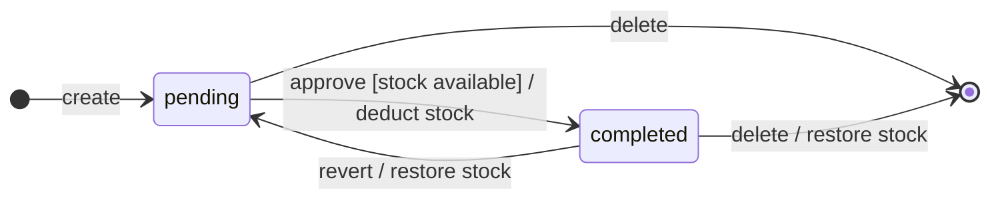
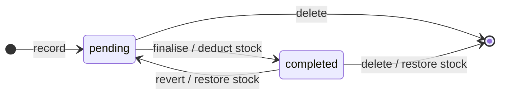
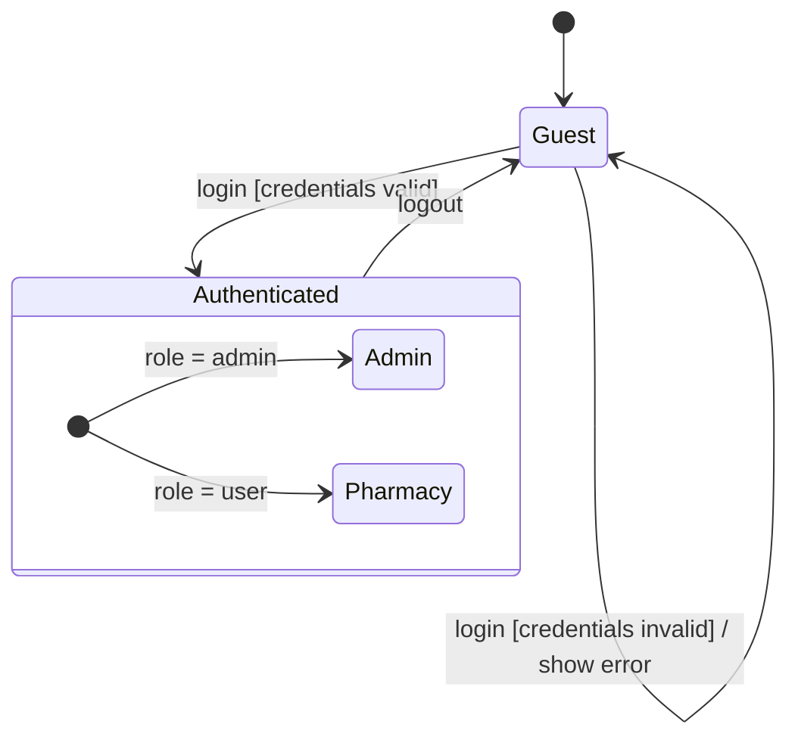
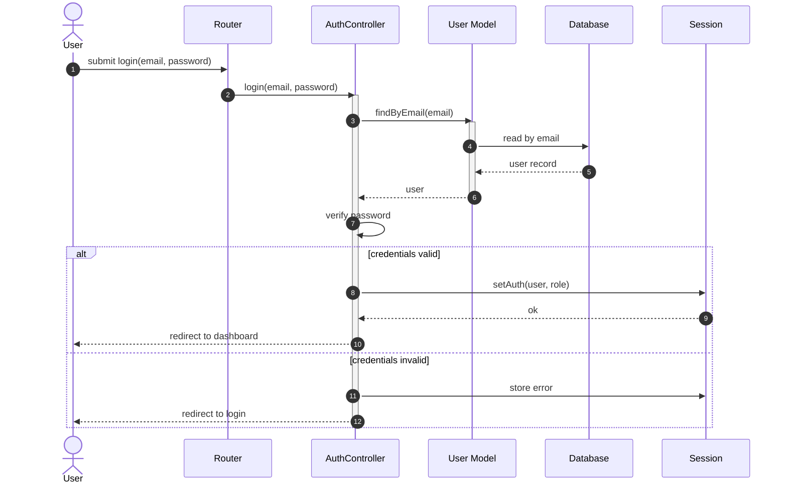
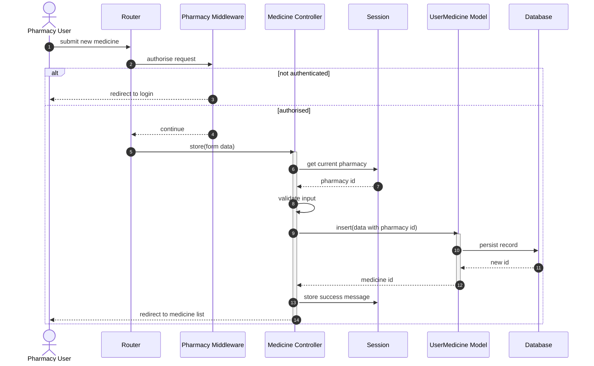

# Dynamic Modelling — State & Sequence Diagrams

Where the [object-modelling chapter](./object-modelling.md) describes MedVault's **static structure** — what classes exist and how they relate — this chapter captures **behaviour over time** through two complementary lenses:

- **State diagrams** model the lifecycle of a single object of a single class — the discrete situations it can be in and the events that move it between them. Three are presented: the `Order` lifecycle, the `Sale` lifecycle, and the authenticated `Session`.
- **Sequence diagrams** model the interaction between *multiple* objects during *one* scenario — the chronological chain of messages exchanged for a single use case. Two scenarios are drawn: a user login, and a pharmacy creating a medicine.

Transition labels use the standard UML form `event [guard] / action`. Sequence diagrams use solid arrows for synchronous calls and dashed arrows for returns; participants are ordered left-to-right in the sequence the request actually traverses them.

---

## State Diagrams

### Order Lifecycle

An `Order` is born `pending`. Approval requires sufficient stock on the linked medicine; on success the order is marked `completed` and the medicine's stock count is decremented as a side-effect of the transition. A `completed` order can be reverted back to `pending`, in which case the deducted stock is restored. Deletion ends the object's lifecycle from either state — and from `completed` it carries the same stock-restore side-effect.

### Sale Lifecycle

The `Sale` lifecycle has the same shape as `Order` minus the stock-availability guard — finalisation deducts unconditionally because a sale represents a transaction that has already occurred. Reverting and deletion mirror the order semantics.

### Authentication Session

A session begins as `Guest`. A failed login is a self-transition that leaves the session in `Guest` but produces an error side-effect. A successful login moves the session into the composite `Authenticated` state, which immediately enters one of two substates determined by the user's role. Logout returns the session to `Guest` from either substate.

---

## Sequence Diagrams

### Login

The `User` actor submits credentials; the `Router` dispatches to `AuthController`, which looks up the user via the model, verifies the password locally, and — depending on the outcome — either authenticates the session and redirects to the dashboard, or stores an error and returns to the login screen.

### Create Medicine

The pharmacy user submits the form; the request is intercepted by `Pharmacy Middleware`, which either rejects an unauthenticated caller or hands control to `Medicine Controller`. The controller reads the owning `pharmacy id` from `Session` (not from the form payload — this is what makes the multi-tenancy boundary trustworthy), validates the input, and inserts a new record via the `UserMedicine` model before redirecting the user back to the medicine list.

---

## How the two views relate

State and sequence diagrams answer different questions about the same system:

- The `Order` state diagram's `pending → completed` transition is *triggered by* a sequence-diagram message — specifically, a controller call equivalent in shape to the Create Medicine flow but routed to the `Order` model's update method. The state diagram shows the *consequence* (status change + stock side-effect); the sequence diagram shows the *conversation* that caused it.
- The `Session` state diagram's `Guest → Authenticated` transition is the visible outcome of the Login sequence diagram's `credentials valid` branch. Conversely, the `credentials invalid` branch corresponds to the `Guest → Guest` self-transition on the state diagram.

This pairing — one diagram per object lifecycle, one diagram per use case — is the core of dynamic modelling: every interaction in a sequence diagram either preserves an object's state or moves it across a transition shown in a state diagram.
