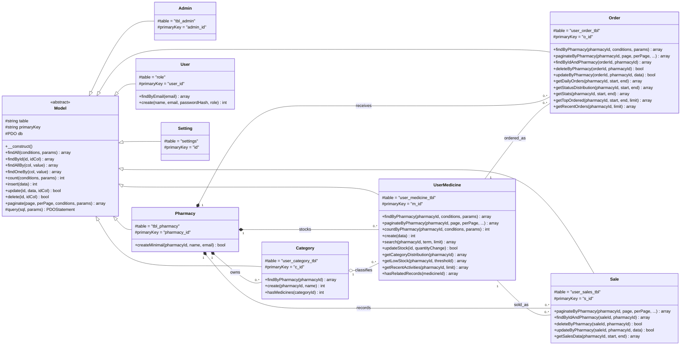
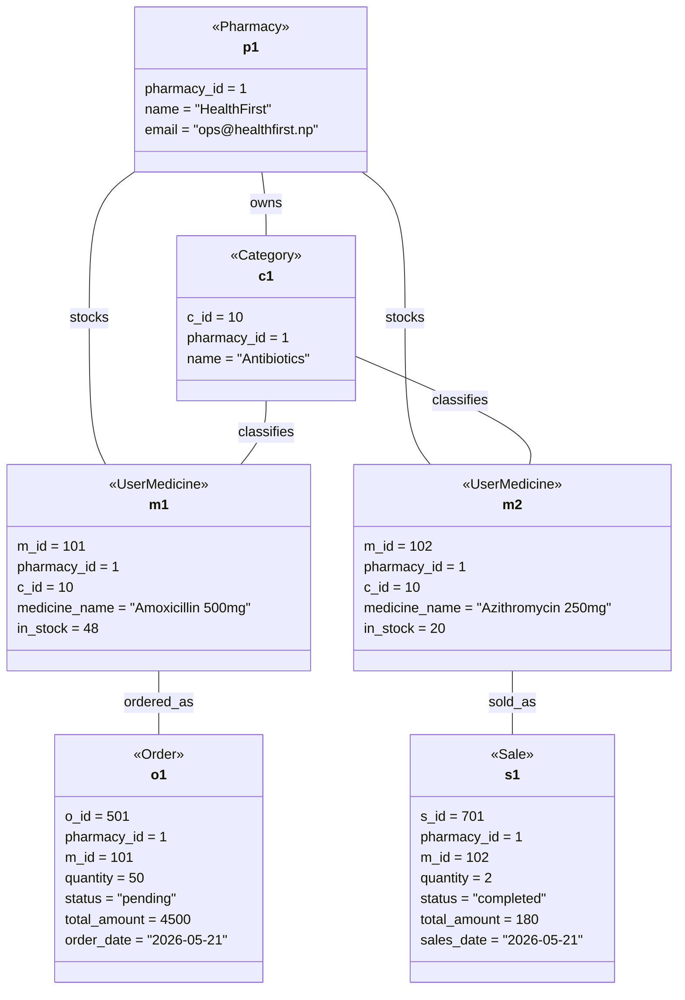

# Object Modelling — Class & Object Diagrams

MedVault's domain layer is built around eight model classes that all inherit from a single abstract base, `App\Core\Model`. The base class encapsulates generic CRUD behaviour against a PDO connection, while each concrete model binds itself to a database table and adds domain-specific query methods (pharmacy-scoped lookups, pagination, analytics). The diagrams below capture this **static structure** (class diagram) and a **single runtime snapshot** of how instances of these classes relate during a day of operation at one pharmacy (object diagram).

---

## Class Diagram

### Legend

| Arrow | Meaning |
|---|---|
| `<|--` | Generalisation (inheritance) — concrete model extends the abstract `Model` |
| `*--` | Composition — the part cannot exist without the whole (every record is `pharmacy_id`-scoped) |
| `o--` | Aggregation — the whole groups the parts, but the parts outlive the grouping |
| `--` | Association — referenced via foreign key but loosely coupled |
| `"1" / "0..*"` | Multiplicity — exactly one on the owning side, zero or more on the owned side |

---

## Object Diagram

> **Note on syntax:** Mermaid has no dedicated object-diagram primitive, so we reuse `classDiagram` with **instance-style labels** (`p1 : Pharmacy`) and fill the bodies with concrete attribute values instead of types. This is the standard UML object-diagram convention rendered in Mermaid.

**Scenario — "HealthFirst Pharmacy, mid-day snapshot":** A single pharmacy with one active category (`Antibiotics`) and two medicines on the shelf. One pending wholesale order has been placed to restock Amoxicillin, and a completed retail sale has just gone through for Azithromycin.

---

## Notes

- **Multi-tenancy by `pharmacy_id`.** Every domain record except `User`, `Admin`, and `Setting` carries a `pharmacy_id`, and every query method on the concrete models filters by it. This is why `Pharmacy` composes the other entities rather than merely associating with them — a `Category` or `Order` row is meaningless without its owning pharmacy.
- **Active-record pattern.** All persistence behaviour lives on the model itself; there are no separate repositories. The abstract `Model` provides `findAll`, `findById`, `insert`, `update`, `delete`, `paginate`, and friends, and concrete models add domain-specific query helpers on top.
- **`Setting`, `User`, and `Admin` are standalone in the class diagram.** They have no foreign-key associations with the domain entities. `User` carries a `role` discriminator (`admin` / `user`) that is read at runtime to select which dashboard a session is sent to, but this is a runtime decision rather than a structural class-level relationship — see the *Authentication Session* state diagram in [dynamic-modelling.md](./dynamic-modelling.md) for that view.
