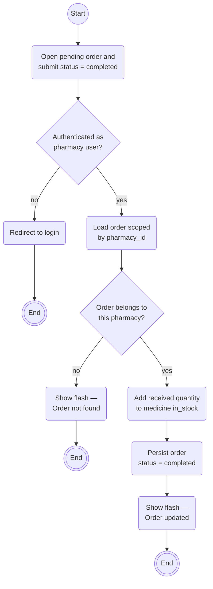
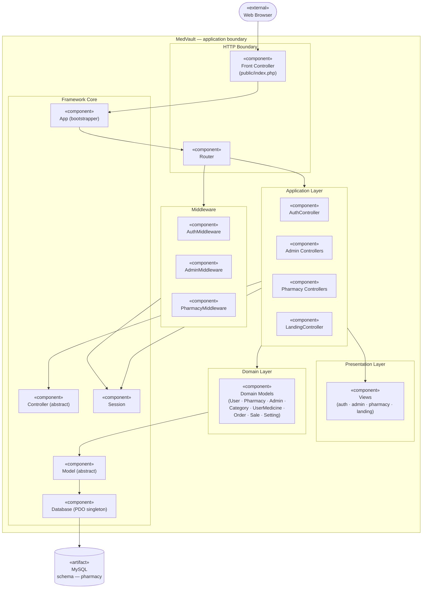
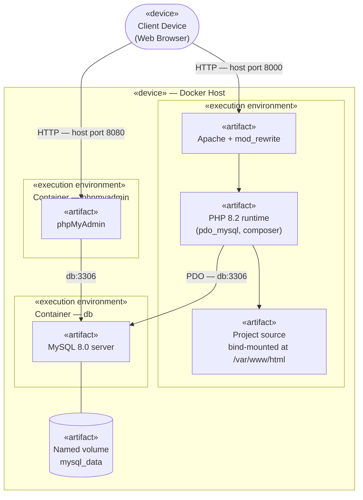

# System Design

This chapter presents MedVault from the implementer's point of view. The class, object, state, and sequence diagrams produced during analysis (chapters [Object Modelling](./object-modelling.md) and [Dynamic Modelling](./dynamic-modelling.md)) already carry implementation-level detail — visibility, types, guards, return arrows — and serve as the refined design artifacts referenced from §3.2.1 below. This chapter adds the three views that analysis does not provide:

- an **Activity diagram** that traces a single end-to-end workflow with its decision points and side-effects;
- a **Component diagram** that shows how the codebase is partitioned into modules and which modules depend on which;
- a **Deployment diagram** that shows the runtime topology — the containers MedVault runs in and how they communicate.

---

## 3.2.1 Refinement of Class, Object, State, Sequence, and Activity Diagrams

The class, object, state, and sequence diagrams in the analysis chapters are already presented in their design-refined form (with types, visibilities, guards, and control-flow fragments) and are not duplicated here. Only the **Activity diagram** is new at design phase.

### Activity Diagram — Order Approval Workflow

The order-receipt workflow is the most behaviourally rich path in the system: it spans a user decision, an authorisation guard, an order lookup, a stock-increase side-effect, and two distinct outcomes. It is the most informative single workflow to model.

**UML shape mapping used below**

| UML element | Meaning | Mermaid rendering |
|---|---|---|
| ● initial node | start of the workflow | `Start(("Start"))` — single circle (rendered as small UML initial node) |
| ◉ activity final | terminal node | `End((("End")))` — double circle (bull's-eye) |
| Rounded rectangle | action / executable step | `("text")` |
| Diamond | decision node (branch) | `{"text?"}` |

The diagram exposes three facts the sequence and state diagrams imply but do not show side-by-side:

1. Authorisation and pharmacy ownership are checked before stock is changed.
2. Completing a supplier order **adds** the received quantity to inventory; sales are the transactions that deduct inventory.
3. The inventory update and status change run in one database transaction, so a failure rolls both changes back.

---

## 3.2.2 Component Diagram

MedVault is organised as six layered components plus the external client and the database. Each box below is a UML `«component»`. Dependencies flow strictly downward — a higher component may depend on a lower one but never the reverse.

**UML element mapping**

| UML element | Meaning | Mermaid rendering |
|---|---|---|
| `«component»` rectangle | a modular, replaceable part with defined responsibility | rectangle with `«component»` in its label |
| `«external»` actor / system | something outside the system boundary | rounded box outside the dashed *MedVault* boundary |
| Dependency arrow | "depends on" / "uses" | solid arrow `-->` |
| Database artifact | persistent storage | cylinder `[("…")]` |

The diagram exposes the **dependency rule** that governs the architecture: every arrow points downward through the stack — Presentation receives output from Application, Application uses Domain and Core, Domain uses Core, and only Core talks to the Database artifact. Framework Core has no incoming dependencies from the layers above it, which is the property that lets the same Core be reused across every controller and model without modification.

---

## 3.2.3 Deployment Diagram

MedVault is deployed as three Docker containers on a single host. The application container serves HTTP through Apache; the database container holds persistent state on a named volume; phpMyAdmin is included as a development convenience.

**UML element mapping**

| UML element | Meaning | Mermaid rendering |
|---|---|---|
| `«device»` node | physical or virtual hardware that hosts an execution environment | outer subgraph labelled `«device»` |
| `«execution environment»` node | runtime container (Docker container, JVM, OS process) inside a device | inner subgraph labelled `«execution environment»` |
| `«artifact»` | a deployable unit — an image, binary, mounted directory, or persistent volume | rectangle with `«artifact»` in its label; cylinder for stored data |
| Communication path | a network or IPC link, labelled with protocol and port | solid arrow with pipe-quoted label |

Key topology facts captured by the diagram:

- The host exposes **two HTTP ports** — `8000` for the application and `8080` for phpMyAdmin — both forwarded from container port `8001` per the compose file.
- The `app` container reaches the database by the **Docker DNS name `db`** (not `localhost`), as configured by the `DB_HOST=db` environment variable.
- MySQL data is persisted on a **named volume (`mysql_data`)**, which is what lets containers be recreated without losing pharmacy, medicine, order, and sale records.
- The project source is **bind-mounted** into the `app` container at `/var/www/html`, so edits on the host are reflected immediately in the container without a rebuild.
